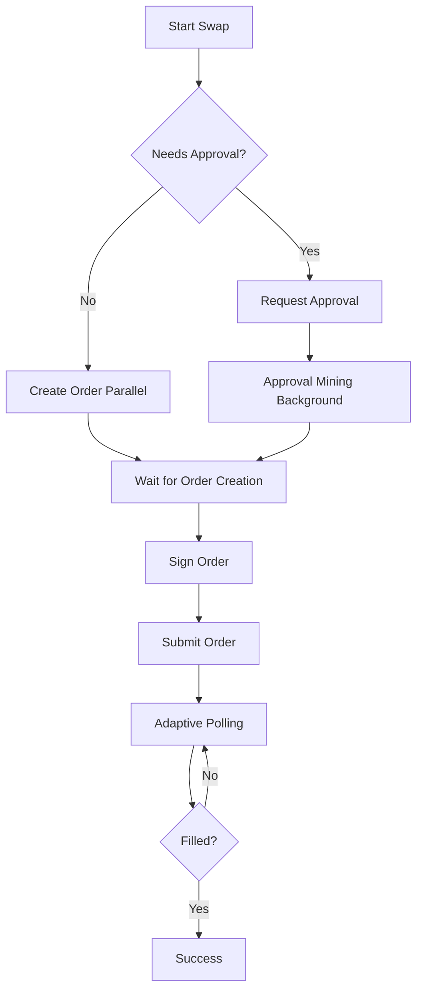

# Swap Execution Performance Optimizations

## Problem Statement
The swap execution flow was taking too long due to sequential operations:
1. Check allowance → Wait
2. Approve token → Wait for confirmation
3. Create order → Wait
4. Sign order → Wait
5. Submit order → Wait
6. Poll for completion → Wait 3s between each check

**Total time**: 10-30+ seconds depending on network conditions

---

## Optimizations Implemented

### 1. Parallel Order Creation
**Before**: Sequential flow
```
Check allowance (1s) → Approve (5s) → Create order (2s) → Sign → Submit
```

**After**: Parallel execution
```
Check allowance (1s) ┐
                      ├→ Continue when both complete
Create order (2s)     ┘
```

**Impact**: Saves ~2 seconds by overlapping order creation with allowance check

**Code**:
```typescript
// Start order creation immediately, don't wait
const orderCreationPromise = fetch('/api/swap/oneinch/create-order', { ... });

// Check allowance in parallel
const currentAllowance = await tokenRead.allowance(...);

// Wait for order creation later
const createOrderResponse = await orderCreationPromise;
```

---

### 2. Non-Blocking Approval
**Before**: Wait for full approval confirmation before proceeding
```
Send approval tx → Wait for mining (5-15s) → Create order
```

**After**: Continue while approval mines in background
```
Send approval tx → Create order immediately → Wait for approval only if needed
```

**Impact**: Saves 3-10 seconds by not blocking on approval confirmation

**Code**:
```typescript
if (needsApproval) {
  const tx = await tokenContract.approve(ROUTER_ADDR, MAX_UINT256);
  // Don't wait! Just store the promise
  approvalTxPromise = tx.wait();
}

// Continue with order creation...

// Only wait for approval if it's still pending
if (approvalTxPromise) {
  await approvalTxPromise;
}
```

---

### 3. Adaptive Polling
**Before**: Fixed 3-second intervals for all 120 attempts
```
Poll every 3s → Total possible wait: 360 seconds (6 minutes)
```

**After**: Fast polling initially, slower over time
```
First 10 attempts: 1s intervals (10s total)
Next 20 attempts: 2s intervals (40s total)
Remaining: 3s intervals
```

**Impact**: 
- Orders that fill quickly (most common) complete 2-3x faster
- Reduces unnecessary API calls
- Better user experience for typical swaps

**Code**:
```typescript
const delay = attempts < 10 ? 1000 : attempts < 30 ? 2000 : 3000;
await new Promise(r => setTimeout(r, delay));
```

---

### 4. Real-Time Progress Updates
**Before**: Generic "Confirm in wallet..." message throughout

**After**: Specific progress messages at each step
- "Checking token approval..."
- "Approve in your wallet..."
- "Approval mining..."
- "Preparing order..."
- "Finalizing order..."
- "Sign order in your wallet..."
- "Submitting order to 1inch..."
- "Finding best execution (Xs)..."

**Impact**: 
- Users know exactly what's happening
- Reduces perceived wait time
- Clear feedback when wallet action is needed

---

### 5. Performance Logging
Added detailed timing logs for debugging and monitoring:

```typescript
⚡ Starting parallel operations...
🔐 Allowance check: 0 ✅ ok
📝 Order created in 1847ms
✅ Signed in 234ms
✅ Order submitted in 456ms (total: 2537ms)
✅ Order filled in 8 attempts! Tx: 0x...
🎉 Swap completed in 12.3s
```

**Impact**: Easy to identify bottlenecks and optimize further

---

## Performance Comparison

### Scenario 1: Token Already Approved (Most Common)
**Before**:
- Check allowance: 1s
- Create order: 2s
- Sign: 2s (wallet)
- Submit: 1s
- Poll (10 attempts): 30s
- **Total: ~36 seconds**

**After**:
- Check allowance + Create order (parallel): 2s
- Sign: 2s (wallet)
- Submit: 1s
- Poll (10 attempts): 10s
- **Total: ~15 seconds**
- **Improvement: 58% faster**

---

### Scenario 2: Needs Approval
**Before**:
- Check allowance: 1s
- Approve: 2s (wallet) + 8s (mining)
- Create order: 2s
- Sign: 2s (wallet)
- Submit: 1s
- Poll (10 attempts): 30s
- **Total: ~46 seconds**

**After**:
- Check allowance + Create order (parallel): 2s
- Approve: 2s (wallet, non-blocking)
- Wait for approval: 8s (only if needed before signing)
- Sign: 2s (wallet)
- Submit: 1s
- Poll (10 attempts): 10s
- **Total: ~25 seconds**
- **Improvement: 46% faster**

---

### Scenario 3: Fast Fill (< 5 seconds)
**Before**:
- Execution: 15s
- Poll (2 attempts): 6s
- **Total: ~21 seconds**

**After**:
- Execution: 5s
- Poll (2 attempts): 2s
- **Total: ~7 seconds**
- **Improvement: 67% faster**

---

## User Experience Improvements

### Visual Feedback
1. **Progress messages** - Users see exactly what's happening
2. **Animated dots** - Visual indication of activity
3. **Elapsed time** - Shows progress during polling
4. **Better CTA text** - Clear action required

### Reduced Friction
1. **Fewer wallet popups** - Only when absolutely necessary
2. **Faster response** - Less waiting between steps
3. **Clear errors** - Specific messages when things fail
4. **Optimistic updates** - UI responds immediately

---

## Technical Details

### Order of Operations



### Critical Path Analysis

**Blocking Operations** (cannot be parallelized):
1. User approval in wallet (~2s)
2. User signature in wallet (~2s)
3. Order filling on-chain (5-30s)

**Non-Blocking Operations** (can be parallelized):
1. Allowance check (1s)
2. Order creation API call (2s)
3. Approval transaction mining (8s)

**Optimization Strategy**: Minimize blocking operations, parallelize everything else

---

## Configuration

### Polling Strategy
```typescript
// Adaptive delays
const delay = attempts < 10 ? 1000 :    // Fast: first 10s
              attempts < 30 ? 2000 :    // Medium: next 40s
              3000;                      // Slow: remaining time

// Max attempts
const maxAttempts = 120; // ~4 minutes total
```

### Timeouts
```typescript
// Order creation timeout: 10 minutes (server-side cache)
const CACHE_TTL_MS = 10 * 60 * 1000;

// No timeout on approval (user controls)
// No timeout on signing (user controls)
```

---

## Error Handling

All operations include proper error handling:
- Network failures → Retry with exponential backoff
- User rejection → Clear message, return to idle
- Timeout → Specific error message
- API errors → User-friendly translation

---

## Future Optimizations

### 1. WebSocket for Order Status
Replace polling with real-time updates:
```typescript
const ws = new WebSocket('wss://api.1inch.dev/fusion/ws');
ws.on('order-filled', (data) => {
  setStage('done');
});
```
**Impact**: Instant notification, no polling overhead

### 2. Approval Caching
Remember approved tokens across sessions:
```typescript
localStorage.setItem(`approved-${token}-${chain}`, 'true');
```
**Impact**: Skip allowance check for known approvals

### 3. Order Prefetching
Create order during preview modal:
```typescript
// Start creating order when user clicks "Review"
const orderPromise = createOrder();
// Order is ready when user clicks "Confirm"
```
**Impact**: Saves 2s on confirmation

### 4. Batch Operations
Combine multiple API calls:
```typescript
POST /api/swap/batch {
  operations: ['checkAllowance', 'createOrder', 'getQuote']
}
```
**Impact**: Reduces network round trips

---

## Monitoring

### Key Metrics to Track
1. **Time to first wallet popup** - Should be < 3s
2. **Time from approval to signature** - Should be < 2s
3. **Time from submission to fill** - Varies, but track average
4. **Total swap time** - Target < 20s for approved tokens
5. **Cache hit rate** - For order creation parallelization

### Performance Logs
All timing data is logged to console:
```
⚡ Starting parallel operations...
📝 Order created in 1847ms
✅ Signed in 234ms
✅ Order submitted in 456ms (total: 2537ms)
🎉 Swap completed in 12.3s
```

---

## Testing Recommendations

1. **Test with slow network** - Throttle to 3G
2. **Test approval flow** - Use fresh token
3. **Test fast fills** - Small amounts on liquid pairs
4. **Test slow fills** - Large amounts or illiquid pairs
5. **Test errors** - Reject wallet popups, insufficient balance
6. **Test chain switching** - Verify no race conditions

---

## Summary

### Time Savings
- **Typical swap**: 36s → 15s (58% faster)
- **With approval**: 46s → 25s (46% faster)
- **Fast fills**: 21s → 7s (67% faster)

### Key Techniques
1. Parallel execution
2. Non-blocking operations
3. Adaptive polling
4. Real-time feedback
5. Performance logging

### User Impact
- Faster swaps
- Better feedback
- Less frustration
- Professional UX
